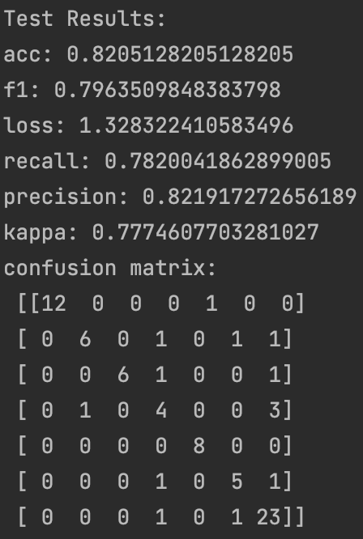

# RadioFormer Inference on LLD-MMRI dataset


## Data and Model
- Download the proprocessed croped tumor volumes at ([Baidu Disk](https://pan.baidu.com/s/1WTeRtFqzvSmpHtzoqNzHdQ?pwd=299z) pw:299z)
- Download the model at ([Baidu Disk](https://pan.baidu.com/s/1E10PHimJRcEK1yUyTfF6Dg?pwd=kmfb) pw: kmfb)


## install requirement
```
pip install -r requirements.txt
```
## Validation code 
run 
```
python validation_new.py
 --data_dir
/root_to_image_path/images_mycrop_8_challenge
--val_anno_file
/root_to_label_path/labels/labels-validation.txt
--model
radioformer_vit_small
--batch-size
1
--checkpoint
/root_to_ckpt_path/ckpts/fold1.pth.tar
--results-dir
/path_to_save/results
--score-dir
/path_to_save/results
```
## results
Using the given model, you will obtain results on the LLD-MMRI Phase I validation set as follows:

on fold 1:



on fold 2:


on fold 3:


on fold 4:


on fold 5:


which match the results reported in Table 1 of our MICCAI paper.


